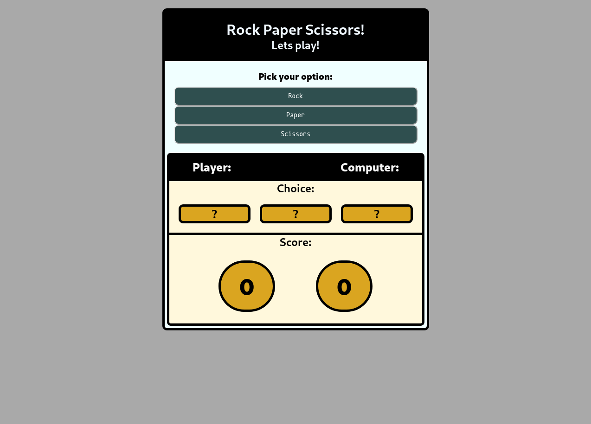
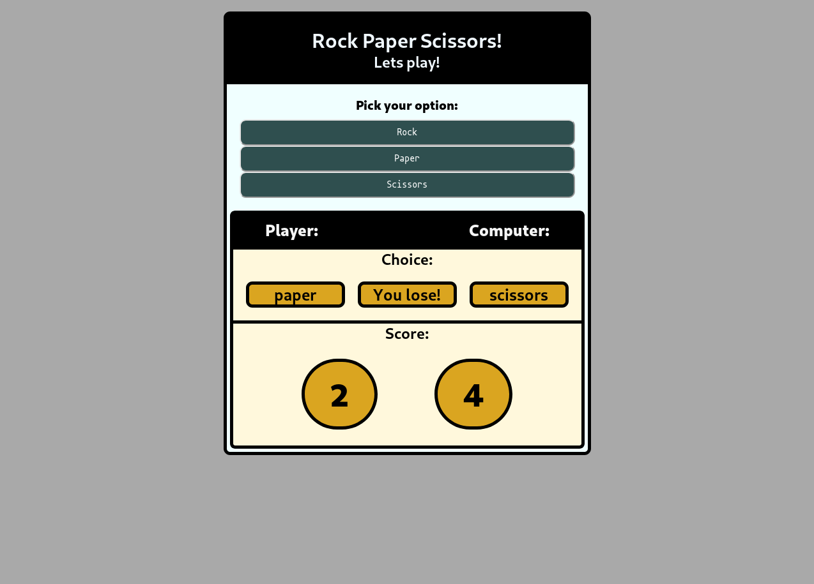
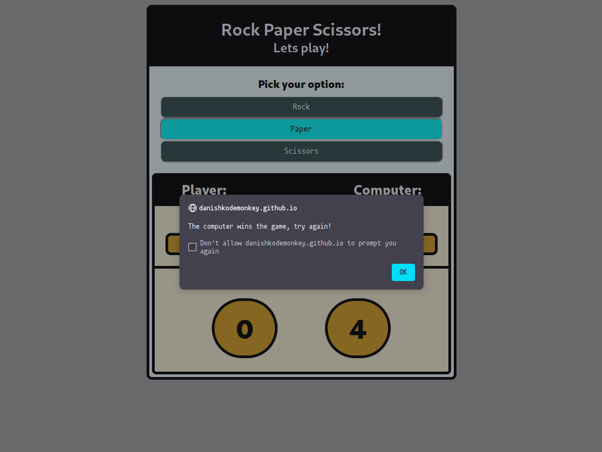

# Rock Paper Scissors

## Self-learn project from [The Odin Project](https://www.theodinproject.com/lessons/foundations-rock-paper-scissors)

### Description

A simple javascript rock-paper-scissors game, made from scratch to put what I've learned from the odin project into practice!

## How does it work?

The game is built on a vanilla HTML/CSS/JS solution, so all from scratch!

The UI is set up on the HTML, and styled on the CSS sheet.

The functionality itself, is handled in the external javascript.

<ul>
<li>The players choice triggers the game logic to start.</li>
<li>This prompts the script to pick a choice for the computer.</li>
<li>The logic then compares the players choice and the computers choice in a switch statement</li>
<li>Depending on who wins the round, the switch statement increments the player, or the computers score.</li>
<li>The UI is then updated to display what the player and computer chose, as well as the result and new score.</li>
<li>
    This keeps going until the game detects that either the player or computer has reached 5 points.
    In this case, the winner is announced, and the game is reset!
</li>
</ul>

## Screenshots

### The game begins

### Not doing too hot...

### Oh no! I lost.

# Try it out!

The project can be tried out on your browsers console!
Go [here](https://danishkodemonkey.github.io/odin-rockpaperscissors/) to try it out!

#### How to play

It's simple, follow the link above to go to the github page, press a button and on the game goes!

First to 5 points win!
